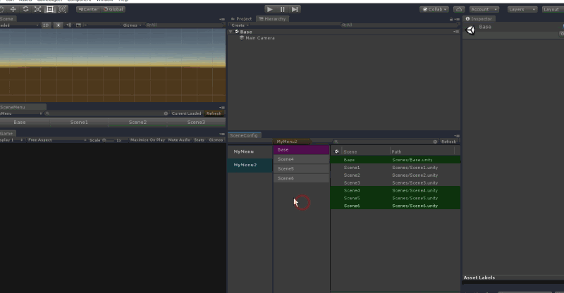
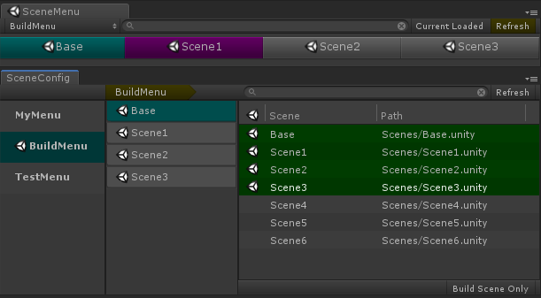
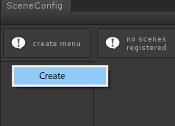
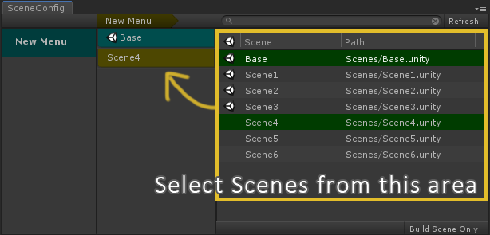
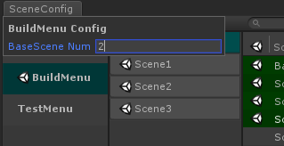
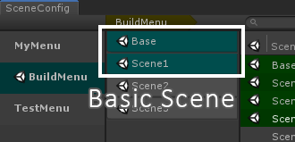
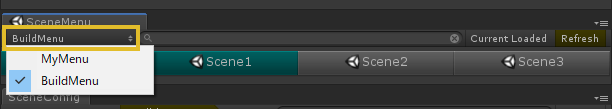
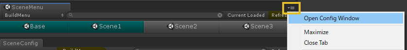
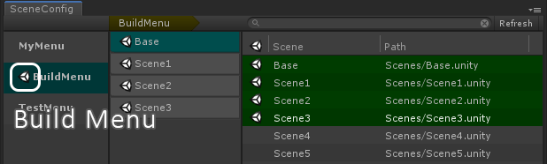

[日本語のREADME](README_JA.md)

# UnitySceneMenu
  
This is a tool for easy control of multi-scene-editing.  
[AssetStore](https://assetstore.unity.com/packages/tools/utilities/unityscenemenu-111222)

## Supported Unity versions
Unity5.6 or newer

# Contact
Any request are welcome :)  
[UnityConnect UnitySceneMenu](https://connect.unity.com/p/unityscenemenu)

# Usage
[Youtube](https://youtu.be/TvXUYsBicRw)  

  

* [Config Window](##Config-Window)
    * [Scene Menu Setting](###Scene-Menu-Setting)
    * [Add Scenes to Menu](###Add-Scenes-to-Menu)
* [SceneMenu Window](##SceneMenu-Window)
* [Auto Build Scenes Setting](##Auto-Build-Scenes-Setting)

## Config Window
To Use SceneMenu, you may create a menu and add scenes to the menu.  
Select [Window]->[SceneMenu]->[Config] to open Config Window.  

### Scene Menu Setting
#### Create Menu
At the left column, create a menu by selecting **[Create] at the right-click context menu**. A menu named *New Menu* will be created and you can edit the name.  
　

#### Edit Menu
Edit a menu by selecting it for long time or selecting [**Rename**] at the right-click context menu.  

#### Delete Menu
Delete a menu by selecting **[Delete] at the right-click context menu**.   

#### Sort Menu Order
Move to any position by dragging a menu.  
  
### Add Scenes to Menu
#### Add Scene
At the right column, there are all scenes in the Project. Select the scenes you want add to the menu.  
When selecting a scene, the scene will be added to the menu and it will be shown at the center column.  
　

#### Remove Scene
Delete a scene by selecting **[Delete] at the right-click context menu**.   
Also delete a scene by selecting the scene again at the right column.  

#### Sort Scene Order
Move to any position by dragging a scene.  
This order is important when you use SceneMenu.  

#### BaseScene Setting
The BaseScene is the scene loaded at first When you switch SceneMenu.  
The BaseScene is displayed as blue color at the scene list.  
The BaseScene must be at the first of the list, but you can change the number of the BaseScene. Select *Name of the Menu* at the top of the center column and set the number of Basic Scene. The scenes from the number from the first scene is set as the BaseScene.

　

## SceneMenu Window
Select [Window]->[SceneMenu]->[Scenes] to open SceneMenu Window.  

### Usage
1. Switch the menu at this area. The menu you created will be shown at pull-down menu.  
  

1. Load a scene by selecting the name of a scene.  

1. When select a scene with holding left-Ctrl key, load the scene only.

1. **Refresh** button reset the load of the scenes.

1. When the menu has a lot of scenes, you can find the scenes by mouse-wheel scrolling. Also, you can find the scene quickly by searching the name of the scene.  

1. The loaded scenes will be displayed when you turn on **Current Loaded** toggle.  

1. You can open Config Window from window menu.    
  

## Auto Build Scenes Setting
You can register the scenes in the menu to the Build Scenes.  

### Set Auto Build Scenes
Select the menu and select **[Set as BuildTarget] at the right-click context menu**. The scenes in the menu are set to the Build Scenes in its order.  The Menu set as BuildTarget has the Scene Icon.  
The scenes added to the menu later set as BuildTarget will be automatically set to Build Scenes.  

  

### Remove Auto Build Scenes
Select the menu and select **[Remove from BuildTarget] at the right-click context menu**.  